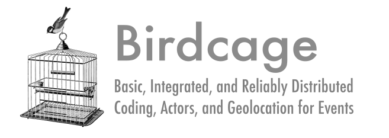

BIRDCAGE is a distributed framework for generating event codings with geolocation. It reads CoreNLP’s output stored in SQLite DB. Biriyani processes raw news articles, generates JSON outputs, and stores them into SQLite DB. Each JSON output of a news article contains date, sentences along with parse tree, etc.  BIRDCAGE integrates both PETRARCH for event coding and Mordecai for extracting Geolocation for those event and stores them as JSON in MongoDB. It has an efficient distributed asynchronous system using Celery and RabbitMQ to address the scalability.

# Installation

- Required Python version: Python 2.7.X    
- Biryani 

```
      git clone -b kalman_filter_all_anno https://github.com/oudalab/biryani
```

- Mordecai 

``` 
      git clone https://github.com/openeventdata/mordecai.git
```
  
- PETRARCH 

```
      pip install git+https://github.com/openeventdata/petrarch2.git
```

- Celery

```
      pip install -U Celery
```

- Birdcage 
 
```
      git clone https://github.com/openeventdata/birdcage.git
```

- MongoDB
   
      Install MongoDB from https://docs.mongodb.com/manual/administration/install-on-linux/

- RabbitMQ
   
      Install RabbitMQ from https://www.rabbitmq.com/install-debian.html  


# Work flow

- Running Biryani & generating CoreNLP output
      Install all dependencies mentioned in https://github.com/oudalab/biryani and follow the procedure of running it.

Step 1: Processing and sending news articles/documents to Biryani

Biryani processes raw news articles and uses CoreNLP to generate annotated text. It uses RabbitMQ for messaging. It has a producer (producer.py) that reads news articles and sends it to RabbitMQ. A news article may be in raw text format or xml format (e.g., Gigaword Dataset). Biryani expects the following JSON format for a news article/document:

```
                  {"news_source": doc['news_source'],
                         "article_title": doc['article_title'],
                         "publication_date": doc['publication_date'],
                         "date_added": datetime.datetime.utcnow(),
                         "article_body": doc['article_body'],
                         "stanford": 0,
                         "language": doc['language'],
                         "doc_id": doc['doc_id'],
                         'word_count': doc['word_count'],
                         'dateline': doc['dateline'],
                         'type': doc['type']
                  }
```

We have to write our own document parsing logic if they are not in XML or JSON format in `producer.py`. You will find a sample producer `gigaword_loader.py` which processes Gigaword AFP dataset (XML format).

Step 2: Running docker and generating output file
       
Biryani comes with docker where CoreNLP runs with multi-threading (details are in https://github.com/oudalab/biryani).

It reads JSON messages from RabbitMQ and generates output in a SQLiteDB. Each news article/document has texts with annotated parse trees generated by CoreNLP.       

- Running Mordecai as a standalone server
  Follow the instruction of running Morecai in https://github.com/openeventdata/mordecai.git
  
  Note: Both Mordecai and Biryani use ELK (Elasticsearch, Logstash, and Kibana). So, if you install them on a same machine, you might have port conflict for ELK. Change elasticserch port in Mordecai's `config.ini` file  and use the following commands while starting it. 
  
```
      [Server]
      geonames_host = localhost
      geonames_port = 9202

  
      sudo docker run -d -p 9202:9202 --name=elastic11 openeventdata/es-geonames
      sudo docker build -t modecai .
      sudo docker run -d -p 5001:5000 -v <FULL PATH of mordecai data>:<FULL PATH of your src data> --link elastic11:elastic mordecai

```
      e.g., `sudo docker run -d -p 5001:5000 -v /home/ahalt/mordecai/data:/usr/src/data --link elastic11:elastic mordecai`
  
  

- Running Celery task in background
  
  Go to birdcage folder. Change MongoDB parameter in mongo_client.py. In tasks.py, change RabbitMQ and MongoDB connection parameter and run following:
 
```
      celery -A tasks worker --loglevel=info
```

  The above command runs celery task where each task will be executed by a worker independently. 
  
  
- Running Birdcase and store events in MongoDB

Open `sqlite_client.py` file and change the appropriate location of CoreNLP output SQLiteDB file (generated by Biryani).
  Run  `celery_test.py`:

```
      python celery_test.py
```

  You will see asynchronous jobs are performing in Celery commandline console (it starts when you run celery tasks). Finally all output will be stored in MongoDB. You will find it in your MongoDB's 'Article' collection. Each news article in MongoDB has encoded event with their Geolocation, actors, etc. 

